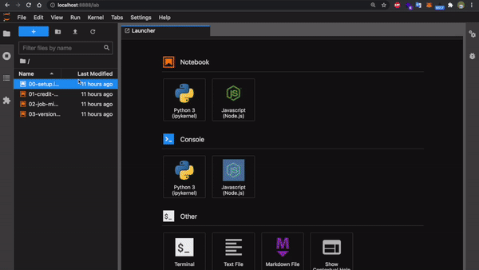

# Keep3r Notebooks

A Jupyter Notebook environment for Keep3r E2E testing.

## Contents

**Artifacts**:

- Keep3rV2
- Keep3r Liquidity Pool Manager
- Keep3rV1Proxy
- Job for Test

**Notebooks**:

- `00-setup`: A common setup for Keep3r environment deployment
- `01-credit-mining`: Time based credit mining (Tokenomics)
- `02-job-migration`: Feature to migrate assets and liquidities to a new job
- `03-version-comparison`: A comparison between both versions with the same job

## Getting Started

1. Execute `yarn install`
1. Execute `yarn jupyter:install`
1. Execute `yarn jupyter`
1. Open `http://localhost:8888/` if not automatically redirected
1. Select `Node.js` as kernel to run all `00-setup.ipynb`
1. Open another notebook and select:
   `Navigation bar > Kernel > Change kernel... > 00-setup.ipynb`
1. Re-run `00-setup.ipynb` to restart the environment
   
1. Execute `yarn jupyter:kill` to terminate the Jupyter environment

### Notebooks utils

- `fetch(abi, address)`: gets contract at address
- `deploy(abi, parameters)`: deploys contract
- `addViewTrace(contract, viewName, viewArgument, traceName)`: registers a view result to be recorded
- `addEventTrace(contract, eventName, timestampIndexArgument)`: registers an event log to be recorded
- **TODO**: `addScriptTrace()`
- `sleep(time)`: advances time
- `sleepAndRecord(timeToSleep, recordEvery)`: advances time and records traces
- `sleepAndExecute(timeToSleep, recordEvery, [{run, every}])`: advances time and records traces while executing a function

### Keep3r utils

- `keep3r.v2`: release candidate of Keep3rV2
- `keep3r.v1`: used for ERC20 implementation
- `keep3r.helper`: implementation of `Keep3rHelper`
- `keep3r.pool`: implementation of `UniV3PairManager` that tokenizes a `UniswapV3` KP3R/WETH 1% fee liquidity position
- `keep3r.keeper`: registered and bonded `keeper`
- `keep3r.governance`: governance of `Keep3rProxy`
- `keep3r.proxy`: governance of `Keep3rV1` and `Keep3rV2`
